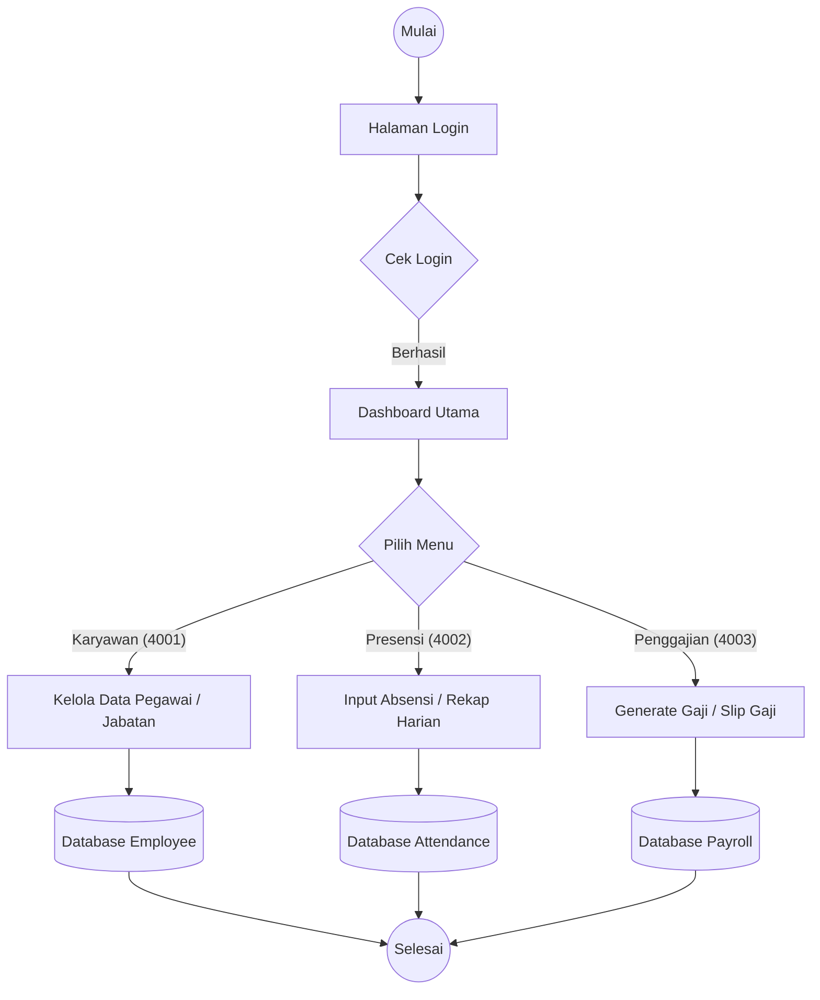

# Dokumentasi Diagram Sistem Presensi & Penggajian

Dokumen ini berisi Use Case Diagram dan Flowchart sistem yang telah disesuaikan dengan struktur baru (3 Port: 4001, 4002, 4003).

## 1. Use Case Diagram

Diagram ini menunjukkan interaksi antara Actor (Karyawan, SDM, Keuangan) dengan sistem.

```mermaid
useCaseDiagram
    actor "Karyawan" as emp
    actor "Admin SDM" as sdm
    actor "Bagian Keuangan" as keu

    package "Sistem Presensi & Penggajian (Port 4001-4003)" {
        usecase "Login (Dummy)" as UC1
        usecase "Presensi Masuk/Pulang" as UC2
        usecase "Melihat Rekap Presensi" as UC3
        usecase "Mengelola Data Karyawan" as UC4
        usecase "Mengelola Jabatan & Dept" as UC5
        usecase "Pengajuan Cuti" as UC6
        usecase "Generate Gaji Bulanan" as UC7
        usecase "Melihat Slip Gaji" as UC8
    }

    emp --> UC1
    emp --> UC2
    emp --> UC3
    emp --> UC6
    emp --> UC8

    sdm --> UC1
    sdm --> UC4
    sdm --> UC5
    sdm --> UC3

    keu --> UC1
    keu --> UC7
    keu --> UC8
```

---

## 2. Flowchart Sistem

Diagram ini menunjukkan alur proses utama dalam sistem.



---

## 3. Catatan Implementasi Port
*   **Port 4001**: Melayani Use Case terkait Karyawan, Departemen, dan Jabatan.
*   **Port 4002**: Melayani Use Case terkait Presensi dan Cuti.
*   **Port 4003**: Melayani Use Case terkait Payroll dan Slip Gaji.
