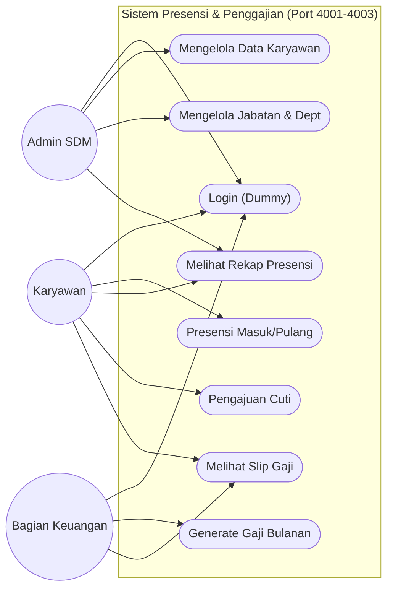
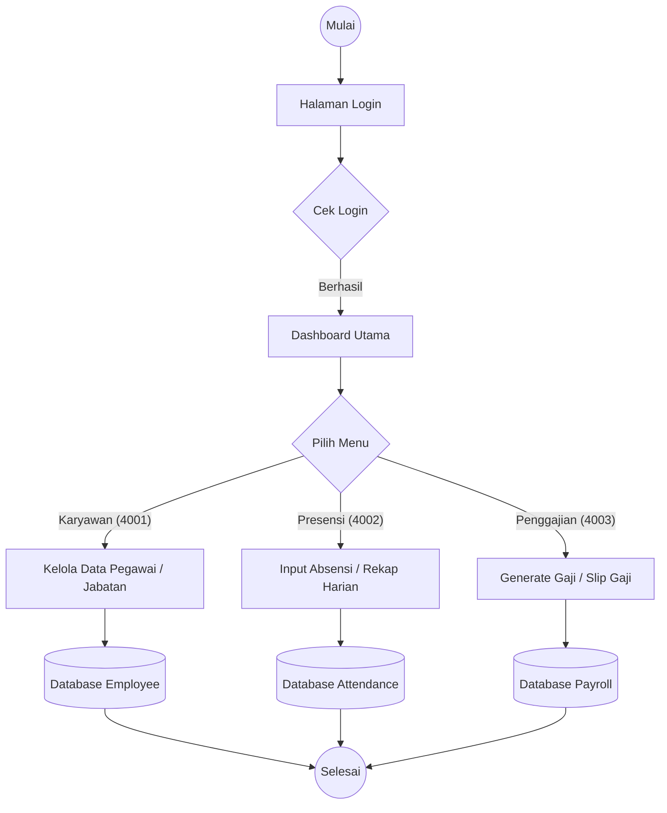

# Dokumentasi Diagram Sistem Presensi & Penggajian

Dokumen ini berisi Use Case Diagram dan Flowchart sistem yang telah disesuaikan dengan struktur baru (3 Port: 4001, 4002, 4003).

## 1. Use Case Diagram

Diagram ini menunjukkan interaksi antara Actor (Karyawan, SDM, Keuangan) dengan sistem.

---

## 2. Flowchart Sistem

Diagram ini menunjukkan alur proses utama dalam sistem.

---

## 3. Catatan Implementasi Port
*   **Port 4001**: Melayani Use Case terkait Karyawan, Departemen, dan Jabatan.
*   **Port 4002**: Melayani Use Case terkait Presensi dan Cuti.
*   **Port 4003**: Melayani Use Case terkait Payroll dan Slip Gaji.
